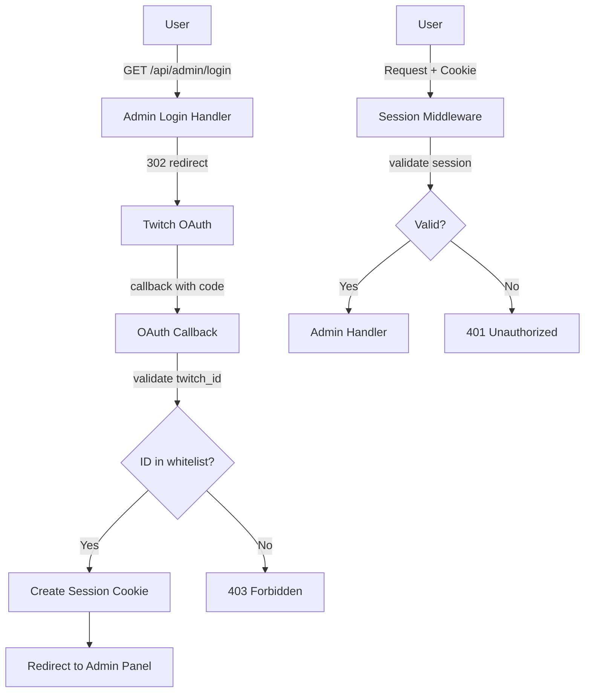

# Admin Panel Cookie Session Authentication Plan

## Overview

Implement cookie-based session authentication for a separate admin panel. Users authenticate via Twitch OAuth, and only whitelisted `twitch_id`s gain admin access.

## Architecture

## Implementation Steps

### 1. Database Migration

- [ ] Create migration `admin_sessions` table
  - `id` TEXT PRIMARY KEY (session token)
  - `twitch_id` TEXT NOT NULL
  - `username` TEXT NOT NULL
  - `created_at` DATETIME
  - `expires_at` DATETIME
- [ ] Create migration `admin_whitelist` table
  - `twitch_id` TEXT PRIMARY KEY
  - `username` TEXT
  - `added_at` DATETIME
  - `added_by` TEXT (twitch_id of admin who added)

### 2. Session Management Module (`src/admin/session.rs`)

- [ ] `SessionManager` struct
  - Cookie name: `admin_session`
  - Cookie settings: HttpOnly, Secure, SameSite=Lax
  - Session duration: 7 days (configurable)
- [ ] `create_session(twitch_id, username)` - creates new session, returns cookie
- [ ] `validate_session(session_id)` - returns session data or None
- [ ] `delete_session(session_id)` - logout
- [ ] `clean_expired_sessions()` - cleanup job

### 3. Admin Whitelist Module (`src/admin/whitelist.rs`)

- [ ] `AdminWhitelist` struct wrapping Db
- [ ] `is_admin(twitch_id)` - check if ID is in whitelist (env or db)
- [ ] `add_admin(twitch_id, username)` - add to database
- [ ] `remove_admin(twitch_id)` - remove from database
- [ ] `list_admins()` - get all admins
- [ ] Load initial admins from `ADMIN_TWITCH_IDS` env var (comma-separated)

### 4. Admin OAuth Module (`src/admin/oauth.rs`)

- [ ] Separate OAuth flow for user authentication (different from broadcaster OAuth)
- [ ] `get_admin_oauth_url()` - generate Twitch OAuth URL with minimal scopes (just `user:read:email`)
- [ ] `exchange_admin_code(code)` - exchange code for token, get user info
- [ ] Validate `twitch_id` is in whitelist before creating session

### 5. Admin Middleware (`src/admin/middleware.rs`)

- [ ] `AdminAuth` extractor - validates session cookie
- [ ] Returns `401` if no/invalid session
- [ ] Returns `403` if valid session but not in whitelist
- [ ] Extracts and provides `twitch_id` and `username` to handlers

### 6. Admin API Handlers (`src/admin/handlers.rs`)

- [ ] `GET /api/admin/login` - redirect to Twitch OAuth
- [ ] `GET /api/admin/callback` - OAuth callback, set cookie
- [ ] `POST /api/admin/logout` - delete session, clear cookie
- [ ] `GET /api/admin/me` - current user info

#### King/Donaters Management

- [ ] `GET /api/admin/king` - view current king
- [ ] `PUT /api/admin/king` - update king
- [ ] `GET /api/admin/month` - view month donaters
- [ ] `POST /api/admin/month` - add month donater
- [ ] `DELETE /api/admin/month/:name` - remove month donater
- [ ] `GET /api/admin/last-day` - view last day donaters
- [ ] `POST /api/admin/last-day` - add last day donater
- [ ] `DELETE /api/admin/last-day/:name` - remove last day donater

#### Push Management

- [ ] `GET /api/admin/push/subscriptions` - list all subscriptions
- [ ] `POST /api/admin/push/test` - send test push
- [ ] `DELETE /api/admin/push/subscription/:endpoint` - delete subscription

#### Admin User Management

- [ ] `GET /api/admin/admins` - list all admins
- [ ] `POST /api/admin/admins` - add new admin
- [ ] `DELETE /api/admin/admins/:twitch_id` - remove admin

### 7. Admin Router (`src/admin/mod.rs` + `src/admin.rs`)

- [ ] Combine all admin routes under `/api/admin/*`
- [ ] Apply `AdminAuth` middleware to all routes except login/callback
- [ ] OpenAPI documentation for admin endpoints

### 8. Configuration

- [ ] `ADMIN_COOKIE_SECRET` env var - for signing session cookies
- [ ] `ADMIN_COOKIE_NAME` env var (default: `admin_session`)
- [ ] `ADMIN_SESSION_DURATION_HOURS` env var (default: 168 = 7 days)
- [ ] `ADMIN_TWITCH_CLIENT_ID` env var (can reuse TWITCH_CLIENT_ID)
- [ ] `ADMIN_TWITCH_CLIENT_SECRET` env var (can reuse TWITCH_CLIENT_SECRET)
- [ ] `ADMIN_TWITCH_REDIRECT_URI` env var
- [ ] `ADMIN_TWITCH_IDS` env var - comma-separated initial admin IDs

### 9. Frontend Placeholder

- [ ] Simple HTML page at `GET /admin` serving as admin dashboard (or redirect to separate frontend)

## Key Design Decisions

1. **Separate from broadcaster OAuth**: The existing OAuth is for EventSub integration. Admin auth uses a separate flow with minimal scopes.

2. **Session ID as Bearer token in cookie**: Use cryptographically random session IDs (not JWT). Store session state in database.

3. **Whitelist-first approach**: Only explicitly whitelisted IDs can access admin panel.

4. **HttpOnly cookies**: Prevent XSS from reading session cookies.

5. **Secure cookies**: Set `Secure` flag in production (HTTPS only).

## Files to Create/Modify

### New Files

- `src/admin/mod.rs` - Admin module root
- `src/admin/session.rs` - Session management
- `src/admin/whitelist.rs` - Admin whitelist logic
- `src/admin/oauth.rs` - Admin OAuth flow
- `src/admin/middleware.rs` - Admin authentication middleware
- `src/admin/handlers.rs` - Admin API handlers
- `migrations/YYYYMMDDHHMMSS_create_admin_tables.up.sql`
- `migrations/YYYYMMDDHHMMSS_create_admin_tables.down.sql`

### Modified Files

- `src/main.rs` - Initialize admin module
- `src/api.rs` - Add admin router
- `src/db.rs` - Add admin-related Db methods
- `Cargo.toml` - Add `axum-extra` for cookie parsing (if not already present)
- `AGENTS.md` - Add admin env vars to documentation

## Env Variables Summary

| Variable                       | Description                        | Required |
| ------------------------------ | ---------------------------------- | -------- |
| `ADMIN_COOKIE_SECRET`          | Secret for signing session cookies | Yes      |
| `ADMIN_SESSION_DURATION_HOURS` | Session lifetime (default: 168)    | No       |
| `ADMIN_TWITCH_IDS`             | Comma-separated initial admin IDs  | Yes      |
| `ADMIN_TWITCH_REDIRECT_URI`    | OAuth callback for admin           | Yes      |

---

### 1. Вход в админку (Authentication Flow)

**Цель:** Создать сессию для доступа к интерфейсу.

1.  **Генерация ссылки:**
    - **Frontend** делает запрос к твоему бэкенду (например, `GET /auth/twitch/url?type=admin`).
    - **Controller** вызывает **AuthService**.
    - **AuthService** генерирует CSRF-токен (`state`), упаковывает в него флаг `target: admin`, сохраняет `state` в кэш/куку и просит **TwitchClient** собрать финальный URL с минимальными скопами.
    - **Результат:** Пользователь получает ссылку и редиректится на Twitch.

2.  **Callback (Возврат от Twitch):**
    - **Twitch** возвращает пользователя на `/auth/callback?code=...&state=...`.
    - **Controller** принимает данные и отдает их в **AuthService.process_callback()**.

3.  **Обработка в AuthService:**
    - Проверяет `state`. Видит флаг `target: admin`.
    - Через **TwitchClient.fetch_tokens(code)** получает `access_token`.
    - Через **TwitchClient.get_user_info(access_token)** получает `twitch_id`.
    - **Зачем:** На этом этапе `AuthService` закончил работу с внешним миром. Он отдает `twitch_id` и флаг `admin` обратно в Controller.

4.  **Авторизация в AdminService:**
    - **Controller** передает `twitch_id` в **AdminService.login()**.
    - **AdminService** лезет в таблицу `admin_whitelist`. Если ID там нет — выкидывает 403.
    - Если ID есть — создает запись в `admin_sessions`, генерирует твой внутренний `session_id`.
    - **Результат:** Бэкенд ставит пользователю куку с `session_id` и редиректит в админку.

---

### 2. Обновление токенов бэкенда (Authorization Flow)

**Цель:** Получить и сохранить `refresh_token` с расширенными правами для работы фоновых задач (например, чтение чата или смена темы стрима).

1.  **Генерация ссылки:**
    - **Frontend** (страница настроек бэкенда) запрашивает URL (например, `GET /auth/twitch/url?type=backend`).
    - **AuthService** делает то же самое, что в первом пункте, но:
      - В `state` упаковывает `target: backend`.
      - В запрос к **TwitchClient** передает **полный список скопов** (channel:manage:broadcast и т.д.).
    - **Результат:** Владелец кликает по ссылке, видит огромный список разрешений от Twitch, подтверждает.

2.  **Callback:**
    - **Controller** снова получает `code` и `state` на тот же эндпоинт `/auth/callback`.
    - Снова отдает их в **AuthService.process_callback()**.

3.  **Обработка в AuthService:**
    - Проверяет `state`. Видит флаг `target: backend`.
    - Вызывает **TwitchClient.fetch_tokens(code)**. Получает объект с `access_token` и `refresh_token`.
    - Вызывает **TwitchClient.get_user_info**, чтобы убедиться, что токены выдал именно владелец канала, а не случайный модератор (сверка с `OWNER_ID` из `.env`).
    - **Зачем:** Получить валидную пару токенов, привязанную к конкретному аккаунту.

4.  **Сохранение в TokenStorage / DB:**
    - **Controller** (или сам AuthService, если так решишь) передает токены в сервис управления ключами.
    - Записывает `refresh_token`, `access_token` и `expires_at` в таблицу настроек (не в сессии!).
    - **Результат:** Бэкенд теперь может в любое время (даже когда стример оффлайн) обновить `access_token` и выполнить действия от имени канала.

---

### Итоговое разделение ответственности:

- **TwitchClient:** Только HTTP-запросы к Twitch. Ему плевать, зачем ты это делаешь.
- **AuthService:** Главный диспетчер. Он знает, как превратить "код из URL" в "ID пользователя и токены". Он понимает разницу между входом админа и получением ключей для системы.
- **AdminService:** Заведует "пропускным режимом" (база данных, вайтлист, сессии). Ему плевать на протокол OAuth, он работает с `twitch_id`.
- **TokenStorage (или БД):** Хранилище долгоживущих ключей для системных нужд.

---

### 1. Этап получения URL (`GET /auth/twitch/url?type=backend`)

Здесь проверка **обязательна**.

- **Кто делает:** Контроллер или Middleware.
- **Логика:** Ты проверяешь текущую сессию пользователя (из `admin_sessions`).
- **Условие:** Только пользователь с `role = 'owner'` (стример) может запрашивать эту ссылку.
- **Зачем:** Чтобы обычный модератор или случайный прохожий даже не мог инициировать процесс привязки системных токенов.

---

### 2. Этап Callback (`GET /auth/callback`)

Здесь проверка **критична**, так как это точка входа данных в твою БД.

- **Кто делает:** `AuthService` или логика контроллера после получения `twitch_id` от Twitch.
- **Логика:** Когда Twitch вернул `code` и ты обменял его на `twitch_id`, ты обязан проверить этот ID.
- **Условие:** Полученный `twitch_id` должен строго совпадать с `OWNER_ID` из твоего `.env` (или из записи в БД с ролью `owner`).
- **Зачем:** Это защита от "подмены аккаунта".
  - _Сценарий атаки:_ Стример (админ) нажимает "Обновить токены", но в окне авторизации Twitch логинится под своим вторым аккаунтом (личным, а не стримерским) или это делает злоумышленник.
  - Если ты не проверишь ID на этапе колбэка, твой бэкенд начнет пытаться управлять чужим каналом, используя валидные, но "не те" токены.

---

### Итоговая схема проверок для `type=backend`:

| Этап                         | Проверка                                                    | Ошибка                               |
| :--------------------------- | :---------------------------------------------------------- | :----------------------------------- |
| **Запрос URL**               | Есть ли у юзера сессия админа и роль `owner`?               | `403 Forbidden`                      |
| **Callback (Code Exchange)** | Соответствует ли `twitch_id` из токена ID владельца канала? | `400 Bad Request` / `Security Alert` |

### Почему не обойтись только одной проверкой?

1.  Если проверять только при запросе URL: Злоумышленник может сформировать ссылку сам (параметры известны) и попробовать заставить стримера кликнуть по ней, либо сам прогнать flow, если найдет способ обойти CSRF.
2.  Если проверять только в Callback: Ты тратишь ресурсы на запрос к Twitch API и создаешь лишний вектор для мусорных данных в системе.
